# Flowchart Semua Modul — SIM-TKD (Modul Edukasi, POLBAN)

Dokumen berisi diagram alur (Mermaid) untuk seluruh modul aplikasi:
**Penerimaan** (perolehan/penerimaan kas) dan **Belanja** (pengeluaran/pembelian),
plus **Akuntansi (AKLAP)** sebagai penutup pencatatan.

---

## 1. Alur Masuk Aplikasi (Login)

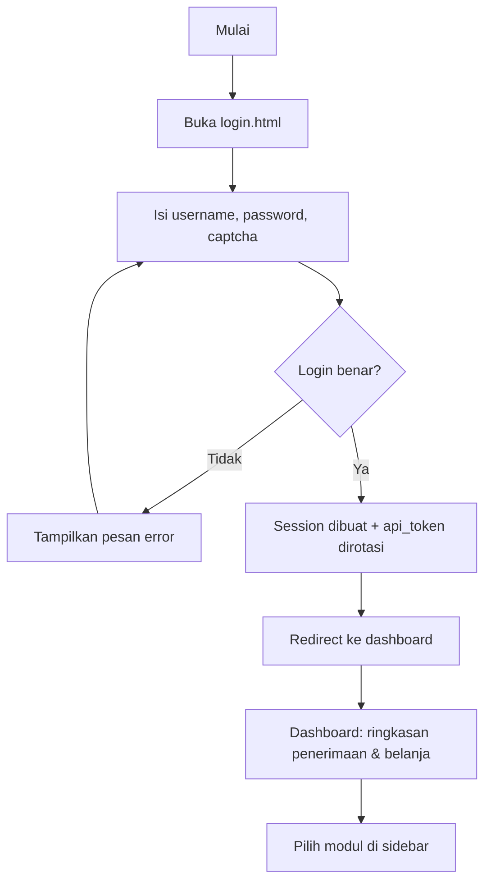

---

## 2. Modul Penerimaan (Penjualan / Pendapatan)

### 2.1 Rekening Permohonan (Dasar Rekening Kas)

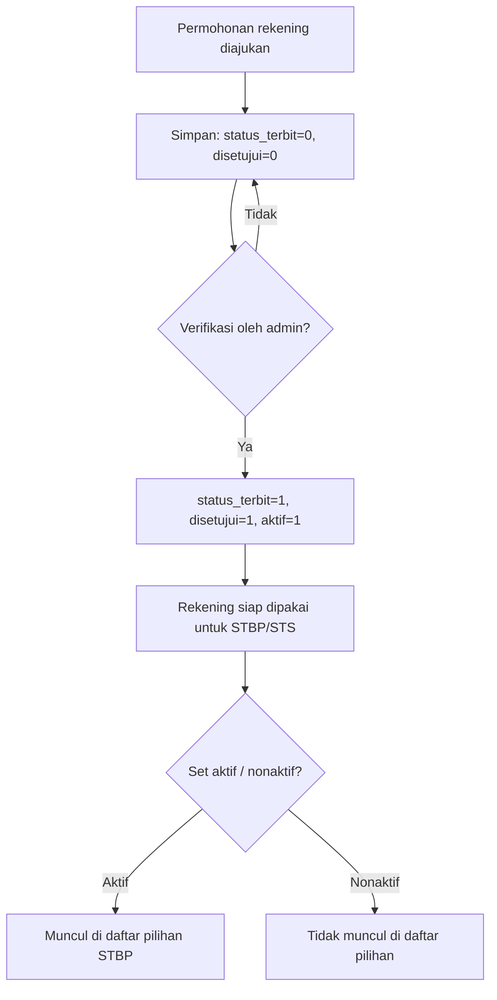

### 2.2 STBP (Surat Tanda Bukti Pembayaran)

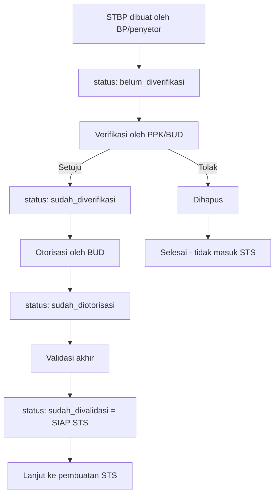

### 2.3 STS (Surat Tanda Setoran)

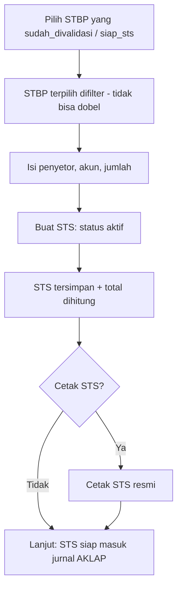

### 2.4 BKU Penerimaan

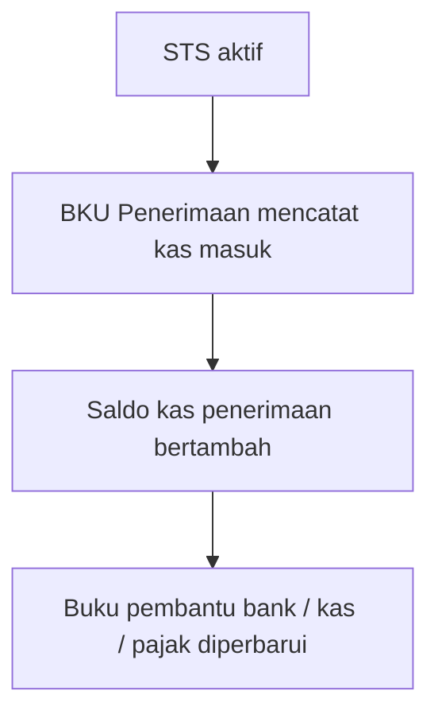

---

## 3. Modul Belanja (Pembelian / Pengeluaran)

### 3.0 Data Pendukung

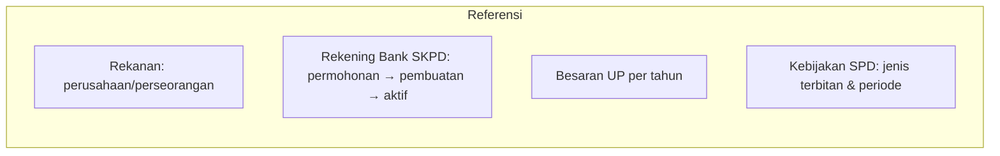

### 3.1 Alur Utama Belanja (SPD → SPP → SPM → SP2D)

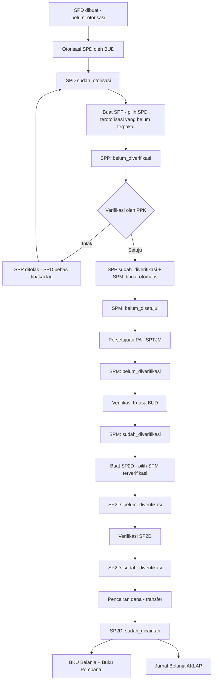

### 3.2 Percabangan Jenis SPP

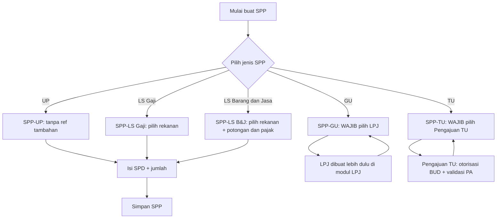

### 3.3 LPJ (referensi SPP-GU)

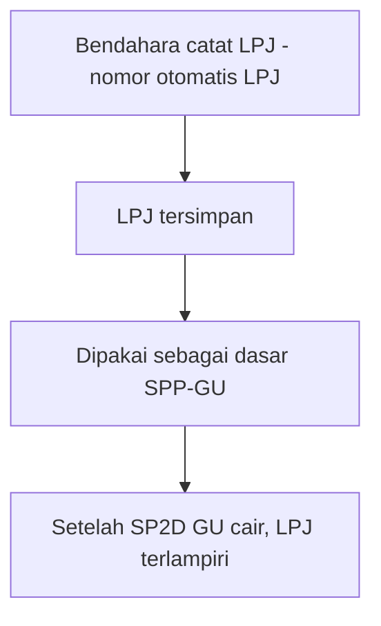

### 3.4 Pengajuan TU (referensi SPP-TU)

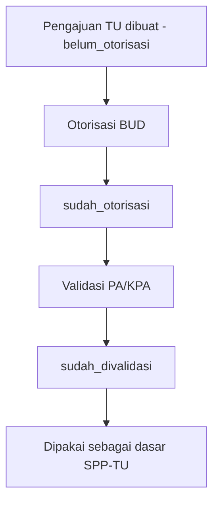

### 3.5 NPD (Nota Pencairan Dana)

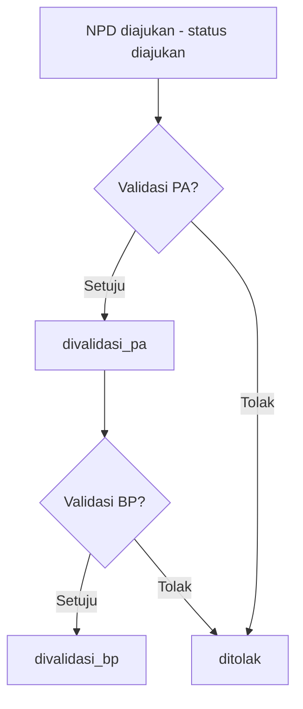

---

## 4. Modul Akuntansi (AKLAP)

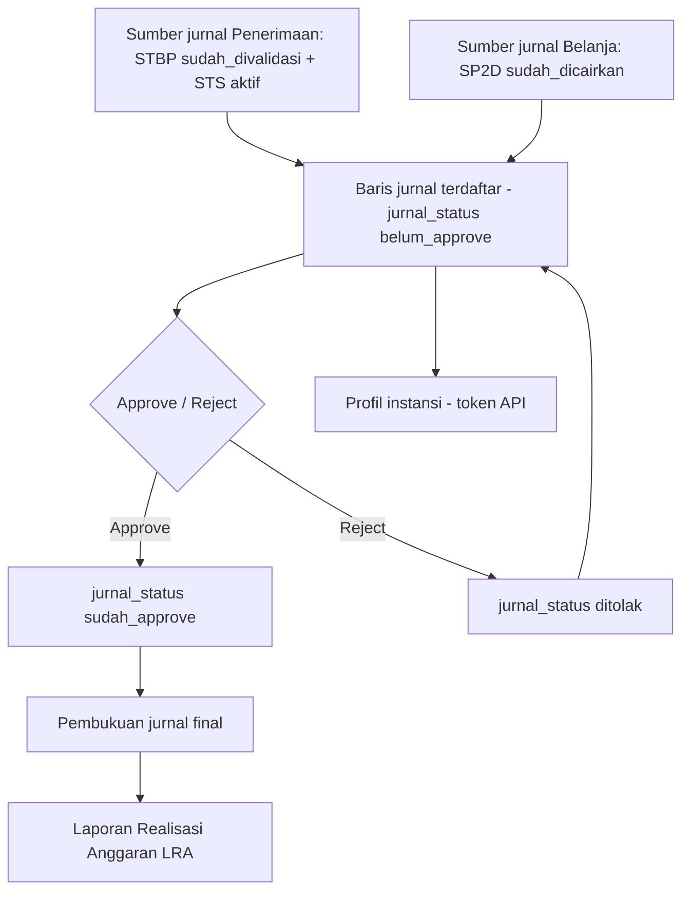

---

## 5. Peta Ringkas Alur (End-to-End)

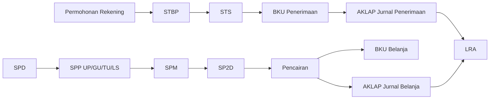

---

## 6. Tanda Tangan Elektronik Dokumen (doc.simtkd.com)

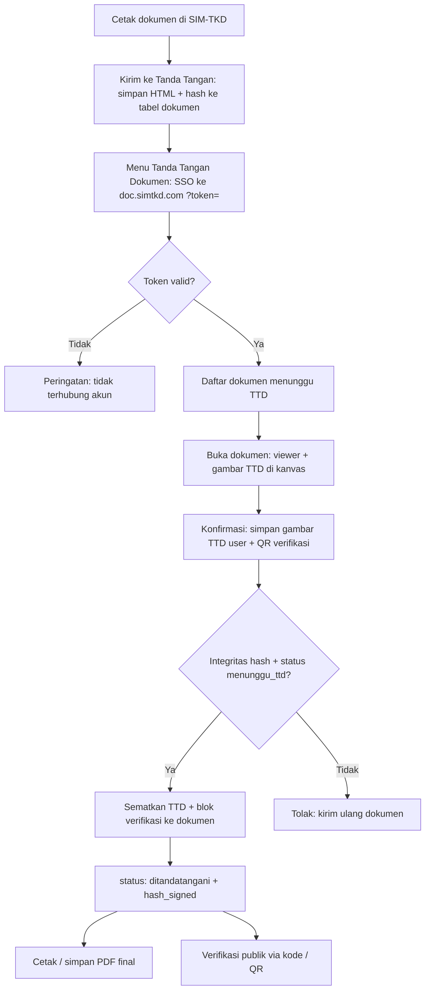

---

